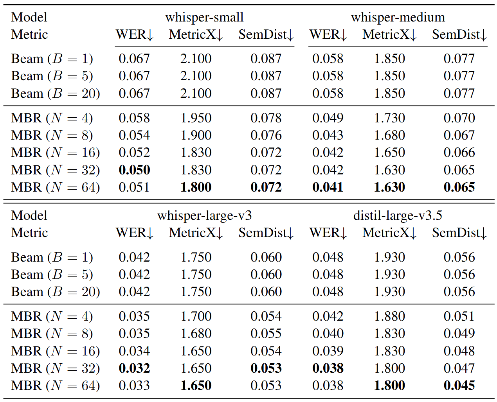

## Minimum Bayes Risk Decoding for Automated Speech Recognition

This repository contains the experiment code for Re-evaluating Minimum Bayes Risk Decoding for Automatic Speech Recognition.



### Setup

Our codebase is developed and tested on Ubuntu 22.04. 
It is not rigorously tested on other platforms.
A Dockerfile is provided for reproducing the code.
The following procedure builds a Docker image used for the experiment.

```
git clone git@github.com:CyberAgentAILab/mbr-for-asr.git
cd mbr-for-asr

docker build . -t mbrasr:latest
```

The codebase can likely run on a native macOS environment by installing dependencies directly with astral-uv instead of using Docker, though this hasn't been rigorously tested. We officially support Ubuntu. PRs to improve macOS compatibility are welcome.

### Experiment

Then, the experiments can be conducted inside the Docker container.
You need to set an environment variable HF_READ_TOKEN to your [huggingface's token](https://huggingface.co/docs/hub/en/security-tokens) to run the code. 
```
docker run -it -e HF_READ_TOKEN=${YOUR HUGGINGFACES TOKEN} mbrasr:latest
```

Inside the docker image, one can run experiments using the scripts in experiments/ directory.

The following command (inside the Docker image) generates samples for MBR decoding.
```
./experiments/sample.sh -d {DOMAIN} -m {MODEL} -s {NSAMPLES}
```
By default, it runs on LibriSpeech domain using [openai/whisper-tiny](https://huggingface.co/openai/whisper-tiny) with 4 samples so that it runs swiftly on CPU. For larger models, we recommend using a GPU.

The generated samples are stored in samples/ directory.

Then, the following command computes the MBR decoding using the sampled outputs.
```
./experiments/run_mbr.sh -d {DOMAIN} -m {MODEL} -s {NSAMPLES} -v {EVALUATION_METRIC}
```
This code runs the evaluation at the same time.
This codebase supports various evaluation metrics, including WER, CER, BLEU, ROUGE, and METEOR.
You can also add your own metric by following the interface defined in [mbr/utility/metricx.py](mbr/utility/metricx.py).

The result of the evaluation is stored in results/ directory.


### Demo

We have a Gradio app to compare beam search and MBR decoding in demo/ directory.
By default, it transcribes English speech in the audio. You can change the task, language, and the ASR model by editting the code [demo/app.py](demo/app.py).
It would be useful to qualitatively evaluate the two decoding algorithms.
To run the app, execute the following command.

```
cd demo
pip install -r requirements.txt
python3 app.py
```

### LICENSE

The codebase is [MIT License](LICENSE), except for the implementation of MetricX in [mbr/utility/metricx.py](mbr/utility/metricx.py) which is owned by Google and distributed under Apache 2.0 license.

### Reference

(TBA) Yuu Jinnai. 2025. Re-evaluating Minimum Bayes Risk Decoding for Automatic Speech Recognition. arXiv.

### Contact

For any questions, feel free to raise an issue or contact me at jinnai_yu@cyberagent.co.jp.
